<div align="center">


<br />


<br />
<br />


<a href="https://ezalden-portfolio.vercel.app/"></a>
<a href="https://www.linkedin.com/in/ezalden-mamon-6154791a4/"></a>
<a href="mailto:ezaldenm6@gmail.com"></a>
<a href="https://github.com/3zzozi"></a>

<br />
<br />


</div>

---

## About

I am a full-stack developer and cybersecurity student specializing in secure web platforms, production-ready applications, penetration testing, cloud computing, and AI-powered product systems. I am currently studying Cybersecurity and Cloud Computing Techniques at Northern Technical University in Mosul, Iraq, with expected graduation in 2027.

My experience spans frontend and backend development, operations support, security testing, vulnerability assessment, ethical hacking, CTF organization, and real-world product delivery. I have worked on applications used by thousands of users, including educational systems, competition platforms, reward-based mobile products, AI scheduling tools, and AI-integrated form analytics platforms.

**Open To**

- Full-stack software engineering roles focused on React, Next.js, Node.js, TypeScript, and production web systems
- Cybersecurity roles involving penetration testing, web security, vulnerability assessment, and ethical hacking
- Cloud computing and DevOps-oriented opportunities involving deployment, Docker, Linux, and server configuration
- AI-powered product engineering, educational technology platforms, and open source collaboration

---

## Tech Stack

<div align="center">

### Languages


### Frontend


### Backend & Databases


### Cloud, DevOps & Tooling


</div>

---

## AI / ML Expertise

| Domain | Proficiency | Details |
|---|---:|---|
| AI Product Engineering | Practical | Built AI-powered applications for scheduling, form analytics, and question generation |
| Scheduling Optimization | Practical | Developed Jaddualah, an AI-powered schedule generator for schools and colleges |
| Speech Recognition Workflows | Practical | Built voice-based data entry capabilities for AI-integrated form management |
| Conversational Analytics | Practical | Designed form analytics workflows where users can query collected data through a conversational interface |
| AI Content Generation | Practical | Integrated AI-driven question generation into a university competition platform |
| Data Processing | Intermediate | Worked on log analysis and MapReduce-inspired processing concepts |
| Security-Aware AI Systems | Intermediate | Applies cybersecurity thinking to AI-enabled workflows, platform design, and user data handling |

---

## Featured Projects

<details>
<summary><strong>School Management Application - Nineveh Elite Institute / Mosul</strong></summary>

<br />

A full-featured mobile application and administrative system for an educational institute, designed around role-based workflows for students, teachers, administrators, parents, and teaching assistants.

| Metric | Details |
|---|---|
| Stack | Frontend Engineering, Mobile UI, Admin System, Role-Based Workflows |
| Scale | Approximately 2000 users |
| Performance | Built for daily educational operations and high-volume role-specific interactions |
| Security | Role-based control across student, teacher, parent, administrator, and assistant access |
| Impact | Delivered a modern education management experience for a real institute in Mosul |
| Repository | Private / Production Project |

The project focuses on usability, scalable functionality, and clean UI/UX for an educational environment with many user types. My role centered on frontend development and product-facing implementation.

</details>

<details>
<summary><strong>Jaddualah</strong></summary>

<br />

An AI-powered web application that automatically generates conflict-free schedules for schools and colleges, solving a difficult academic scheduling problem by producing optimized timetables in seconds.

| Metric | Details |
|---|---|
| Stack | Full-Stack Development, AI Scheduling, Web Application Architecture |
| Scale | Used by selected schools in private beta |
| Performance | Generates optimized timetables quickly from scheduling constraints |
| Security | Private beta access model for controlled institutional usage |
| Impact | Reduces manual scheduling complexity for schools and colleges |
| Repository | Private Beta |

Jaddualah demonstrates practical AI product engineering: taking a high-friction administrative workflow and converting it into a usable, automated, institution-ready platform.

</details>

<details>
<summary><strong>Dinar Win</strong></summary>

<br />

An ad-driven mobile application that enables users to win rewards while providing a platform for targeted advertising and audience engagement.

| Metric | Details |
|---|---|
| Stack | Frontend-Focused Full-Stack Development, Mobile Product Workflows |
| Scale | Approximately 1500 active users in Mosul |
| Performance | Built for smooth user interaction, campaign delivery, and reward-based engagement |
| Security | Structured product flows for controlled user activity and platform operations |
| Impact | Active local product with a growing user base and advertising utility |
| Repository | Private / Production Project |

My work included frontend-focused full-stack development and operational support, contributing to a product that connects user engagement with business advertising needs.

</details>

<details>
<summary><strong>Athar Form</strong></summary>

<br />

An AI-integrated form management platform that extends conventional form builders with voice-based data entry, speech recognition, advanced analytics, and conversational querying.

| Metric | Details |
|---|---|
| Stack | Full-Stack Development, AI Analytics, Speech Recognition, Multi-Form Management |
| Scale | Private beta platform for scalable form collection and analysis |
| Performance | Reduces manual data processing through AI-assisted querying and analytics |
| Security | Built around managed form data workflows and controlled platform usage |
| Impact | Makes form data easier to collect, query, analyze, and operationalize |
| Repository | Private Beta |

Athar Form focuses on reducing the complexity of form-based data processing by combining AI analytics, voice input, and conversational interfaces in one platform.

</details>

<details>
<summary><strong>UniCompete</strong></summary>

<br />

A full-scale competition platform supporting structured competitive events, multiple play modes, advanced role-based permissions, polished UI/UX, and AI-driven question generation.

| Metric | Details |
|---|---|
| Stack | Frontend-Focused Full-Stack Development, AI Question Generation, Role-Based Permissions |
| Scale | Officially deployed and used by the University of Mosul |
| Performance | Designed for structured competitions, scalable content creation, and event operations |
| Security | Advanced permission model for organizers, participants, and platform roles |
| Impact | Real institutional adoption with planned expansion to other academic institutions |
| Repository | Private / Institutional Project |

UniCompete combines product engineering, educational technology, AI-assisted content generation, and real event operations in a deployed academic platform.

</details>

<details>
<summary><strong>Demonstration Platform</strong></summary>

<br />

An educational OAuth security simulation that demonstrates how access tokens work, how token theft can happen, and why insecure token handling creates real security risk.

| Metric | Details |
|---|---|
| Stack | Next.js, TypeScript, Python, Flask |
| Scale | Educational full-stack demo with frontend, backend, token flow, and protected views |
| Performance | Lightweight local execution with separate backend and frontend services |
| Security | Simulates token theft, token replay, expiration behavior, and insecure storage patterns |
| Impact | Teaches OAuth security concepts through hands-on demonstration |
| Repository | [View Repository](https://github.com/3zzozi/Demonstration-Platform) |

This project is designed for responsible cybersecurity education. It explains token-based authentication risks in a controlled environment and helps learners understand why secure token handling matters in production systems.

</details>

<details>
<summary><strong>Log Analyze With MapReduce</strong></summary>

<br />

A log analysis project designed around distributed-processing concepts, combining a web interface with Python-backed analysis logic to process and understand log data.

| Metric | Details |
|---|---|
| Stack | TypeScript, Python, Next.js, Data Processing |
| Scale | Built for structured log ingestion, analysis workflows, and result presentation |
| Performance | MapReduce-inspired processing model for scalable log analysis concepts |
| Security | Log-centered workflow useful for auditing, monitoring, and operational visibility |
| Impact | Demonstrates data engineering, distributed systems thinking, and applied analytics |
| Repository | [View Repository](https://github.com/3zzozi/Log-analyze-with-MapReduce) |

This project connects software engineering with security and data analysis by showing how large-scale log data can be processed, summarized, and used to support operational decisions.

</details>

<details>
<summary><strong>Ezalden Portfolio</strong></summary>

<br />

A modern personal portfolio built with a full-stack product mindset, designed to present engineering skills, projects, technical identity, and recruiter-facing information in a clean web experience.

| Metric | Details |
|---|---|
| Stack | Next.js, TypeScript, Tailwind CSS, Vercel |
| Scale | Public portfolio and professional engineering profile |
| Performance | Static-first rendering, optimized frontend assets, lightweight page delivery |
| Security | Minimal exposed surface, managed hosting, secure public contact flow |
| Impact | Central portfolio hub for projects, skills, experience, and professional branding |
| Repository | [View Repository](https://github.com/3zzozi/Ezalden-Portfolio) |

This project demonstrates ownership of frontend architecture, responsive design, portfolio communication, deployment, and personal technical branding through a production-ready web application.

</details>

---

## Experience

### Full-Stack Developer, Operations & Media Manager - Athar  
**Current - Remote / Hybrid**

Develop and maintain application components within Athar Group while supporting product operations, media workflows, and platform execution for active products including DinarWin.

- Develop and maintain frontend and backend components to improve functionality and user experience
- Support operational processes for DinarWin, ensuring smooth performance and execution
- Manage DinarWin social media strategy, including content planning and design production oversight
- Coordinate with team members to deliver consistent platform updates and high-quality content
- Combine engineering execution with product operations, technical support, and public-facing communication

`TypeScript` `JavaScript` `React` `Next.js` `Node.js` `Operations` `Content Strategy` `Product Delivery`

### Cybersecurity & Cloud Computing Student - Northern Technical University  
**Bachelor of Cybersecurity and Cloud Computing Techniques - Expected Graduation 2027**

Currently studying cybersecurity and cloud computing with strong academic performance, hands-on project work, penetration testing practice, and university-level leadership involvement.

- Maintain consistently high academic performance in cybersecurity and cloud computing studies
- Earned multiple official honors from the President of Northern Technical University
- Represented Northern Technical University at the 6th Leadership Development Conference, University of Sharjah
- Participate in cybersecurity competitions, CTF communities, and practical technical learning
- Build real software projects across web development, cloud systems, AI features, and security education

`Cybersecurity` `Cloud Computing` `Penetration Testing` `Linux` `Docker` `Web Security` `CTF`

### Organizer - Ashur CTF 2025  
**2025 - Cybersecurity Competition - Mosul**

Contributed to cybersecurity community building through competition organization, technical coordination, and practical security learning experiences.

- Helped organize Ashur CTF 2025 as a cybersecurity competition in Mosul
- Supported security-focused learning through challenge-driven community activity
- Participated actively in cybersecurity competitions and technical communities
- Applied penetration testing and web security knowledge in practical event environments

`CTF` `Web Security` `Vulnerability Assessment` `Ethical Hacking` `Community Leadership`

---

## Achievements

<div align="center">

| Recognition | Details |
|---|---|
| eJPT Certified | Earned eLearnSecurity Junior Penetration Tester certification through INE Security |
| TryHackMe Certifications | Completed Cyber Security 101, Jr Penetration Tester, Web Fundamentals, and related learning paths |
| Academic Excellence | Honored multiple times by the President of Northern Technical University |
| University Representative | Official representative of Northern Technical University at the 6th Leadership Development Conference, University of Sharjah |
| Ashur CTF 2025 Organizer | Organized cybersecurity competition activity in Mosul |
| UniCompete Core Team | Core organizing team member for University of Mosul competitions powered by UniCompete |
| Production Product Experience | Worked on deployed platforms with approximately 2000 users and 1500 active users |

</div>

---

## Certifications

### INE Security


### TryHackMe


### University of Sharjah


### Northern Technical University


---

## Coding Profiles

<div align="center">

<a href="https://github.com/3zzozi"></a>
<a href="https://tryhackme.com/"></a>
<a href="https://ezalden-portfolio.vercel.app/"></a>
<a href="https://www.linkedin.com/in/ezalden-mamon-6154791a4/"></a>

</div>

---

## GitHub Analytics

<div align="center">


<br />


</div>

---

## GitHub Trophies

<div align="center">



</div>

---

## Contribution Activity

<div align="center">


</div>

---

## Contribution Snake

<div align="center">


</div>

---

## Current Focus

```yaml
Learning:
  - Advanced penetration testing
  - Web security and vulnerability assessment
  - Cloud computing and server configuration
  - Production-grade full-stack architecture

Building:
  - AI-powered scheduling systems
  - Cybersecurity education platforms
  - Competition and event management platforms
  - AI-integrated form analytics tools

Exploring:
  - Ethical hacking workflows
  - Secure authentication and OAuth risk
  - Speech recognition and conversational analytics
  - Docker-based deployment and Linux environments

Open To:
  - Full-Stack Developer roles
  - Penetration Testing opportunities
  - Cybersecurity Engineering roles
  - Cloud Computing roles
  - AI Product Engineering projects
```

---

## Connect

<div align="center">

<a href="mailto:ezaldenm6@gmail.com"></a>
<a href="https://www.linkedin.com/in/ezalden-mamon-6154791a4/"></a>
<a href="https://github.com/3zzozi"></a>
<a href="https://ezalden-portfolio.vercel.app/"></a>

</div>

---

<div align="center">

**Building secure platforms, intelligent products, and production-ready software with precision.**


</div>
